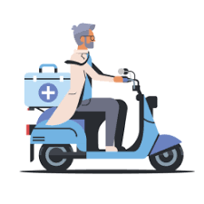

# Project Responsive Web Design using Bootstrap
## Date:26.12.24

## AIM:
To create a simplified clone of Dribbble (https://dribbble.com/) landing page.


## DESIGN STEPS:

### Step 1:
Clone the repository from GitHub.

### Step 2:
Create Django Admin project.

### Step 3:
Create a New App under the Django Admin project.

### Step 4:
Insert the necessary CSS and JavaScript files as external in order to use Bootstrap.

### Step 5:
Create a HTML file and include the needed Bootstrap components.

### Step 6:
Publish the website in the LocalHost.

## PROGRAM :
```
<!DOCTYPE html>
<html lang="en">
<head>
  <meta charset="UTF-8">
  <meta name="viewport" content="width=device-width, initial-scale=1.0">
  <title>Bootstrap Website</title>
  <link href="https://cdn.jsdelivr.net/npm/bootstrap@5.3.0-alpha3/dist/css/bootstrap.min.css" rel="stylesheet">
</head>
<body>
    <nav class="navbar navbar-expand-lg navbar-light bg-secondary">
        <div class="container-fluid">
         
          <a class="navbar-brand text-white" href="#">Dribbble</a>
          
          
          <button class="navbar-toggler" type="button" data-bs-toggle="collapse" data-bs-target="#navbarNav" aria-controls="navbarNav" aria-expanded="false" aria-label="Toggle navigation">
            <span class="navbar-toggler-icon"></span>
          </button>
          
          
          <div class="collapse navbar-collapse" id="navbarNav">
            <ul class="navbar-nav me-auto">
              <li class="nav-item"><a class="nav-link text-white" href="#">Shots</a></li>
              <li class="nav-item"><a class="nav-link text-white" href="#">Designers</a></li>
              <li class="nav-item"><a class="nav-link text-white" href="#">Teams</a></li>
              <li class="nav-item"><a class="nav-link text-white" href="#">Community</a></li>
              <li class="nav-item"><a class="nav-link text-white" href="#">Jobs</a></li>
            </ul>
      
            
            <form class="d-flex me-3">
              <input class="form-control me-2" type="search" placeholder="Search" aria-label="Search">
              <button class="btn btn-outline-light" type="submit">Search</button>
            </form>
            <a href="#" class="btn btn-light me-2">Sign In</a>
            <a href="#" class="btn btn-pink">Sign Up</a>
          </div>
        </div>
      </nav>
      
      <style>
        .btn-pink {
          background-color: #ff69b4; /* Pink color */
          color: white;
          border: none;
        }
        .btn-pink:hover {
          background-color:white; /* Slightly lighter pink on hover */
        }
      </style>
            
  
  <div class="container text-center my-5">
    <h1 class="mb-3">What are you working on?</h1>
    <p>Dribbble is show and tell for designers.</p>
    <button class="btn btn-primary">Learn More</button>
    <button class="btn btn-pink">Sign Up</button>
  </div>

  
  <div class="container">
    <div class="row row-cols-1 row-cols-md-4 g-4">
      
   

      <div class="col">
        <div class="card h-100">
          
          <div class="card-body">
            <h5 class="card-title">Web craft studio</h5>
          </div>
          <div class="card-footer text-center">
            <small class="text-muted">5,144k likes</small>
          </div>
        </div>
      </div>

      <div class="col">
        <div class="card h-100">
          
          <div class="card-body">
            <h5 class="card-title">Make money</h5>
          </div>
          <div class="card-footer text-center">
            <small class="text-muted">8,555k likes</small>
          </div>
        </div>
      </div>

      <div class="col">
        <div class="card h-100">
          
          <div class="card-body">
            <h5 class="card-title">Designer 3D</h5>
          </div>
          <div class="card-footer text-center">
            <small class="text-muted">4,035k likes</small>
          </div>
        </div>
      </div>

      <div class="col">
        <div class="card h-100">
          
          <div class="card-body">
            <h5 class="card-title">Make meals food delivery</h5>
          </div>
          <div class="card-footer text-center">
            <small class="text-muted">6,078k likes</small>
          </div>
        </div>
      </div>

      <div class="col">
        <div class="card h-100">
          
          <div class="card-body">
            <h5 class="card-title">Carts home delivery</h5>
          </div>
          <div class="card-footer text-center">
            <small class="text-muted">3,056k likes</small>
          </div>
        </div>
      </div>

      <div class="col">
        <div class="card h-100">
          
          <div class="card-body">
            <h6 class="card-title">Medico plus</h6>
          </div>
          <div class="card-footer text-center">
            <small class="text-muted">6,250kk likes</small>
          </div>
        </div>
      </div>
      <div class="col">
        <div class="card h-100">
          
          <div class="card-body">
            <h7 class="card-title">Fashiono world</h>
          </div>
          <div class="card-footer text-center">
            <small class="text-muted">2,054k likes</small>
          </div>
        </div>
      </div>

    </div>
  </div>


  <footer class="bg-warning text-center py-3 mt-5">
    <p>Designed And Developed by Harini S</p>
  </footer>

  <script src="https://cdn.jsdelivr.net/npm/bootstrap@5.3.0-alpha3/dist/js/bootstrap.bundle.min.js"></script>
</body>
</html>
```


## OUTPUT:
.png>)
.png>)


## RESULT:
The Project for responsive web design using Bootstrap is completed successfully.
